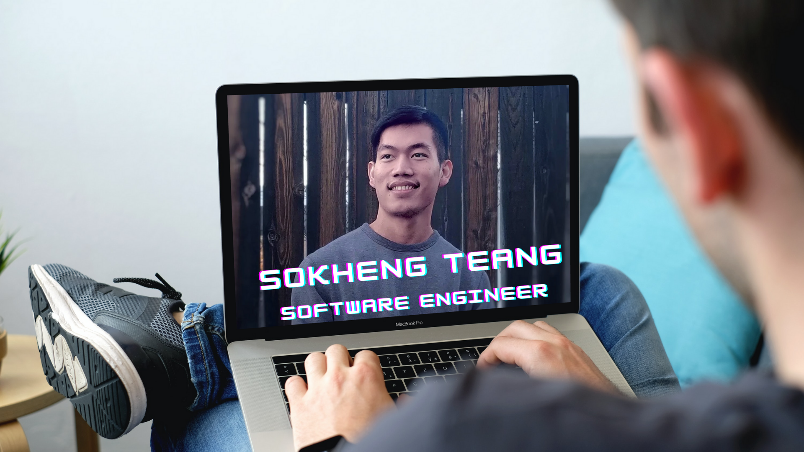

# Hello, I'm Sokheng Teang 👋🏾

Welcome to my Github! My name is Sokheng Teang (<a href="https://www.howtopronounce.com/sokheng">pronunciation </a>).

I'm a Software Engineer, with a background in applied mathematics and social science. On this GitHub, you will find some of the personal projects that I have worked on during my time at Flatiron.

After attending the coding bootcamp, Flatiron School, I have experience with HTML, CSS, Javascript, React, SQL, Ruby, Object-Oriented Programming, Ruby on Rails, Sinatra, ActiveRecord, Heroku, SQLite, PostgreSQL, RSpec, MVC Software Architecture, Canva, Git, and Github.

I'm looking for Frontend Software Engineering roles primarily, and secondly for roles as a Full-Stack Software Engineer. I am very interested in being in an environment where I can grow, learning languages such as Python, three.js, Java, C#, C++, Vue.js, machine learning, etc.

I am originally from Cambodia, and I currently live in California. I speak Khmer (my native language), and English.

I am passionate about using technology to create social impact, and I strongly believe that education is the key to success. In my spare time, I enjoy reading, hiking, and playing video games.

## Find me on other sites:

- Keep up to date with me on my <a href="https://www.linkedin.com/in/sokhengteang/">LinkedIn</a> 💼 👨🏾‍💻
- Follow my blog on <a href="//https://medium.com/@sokheng23/"> Medium</a> 💻
